<h2>TensorFlow-FlexUNet-Image-Segmentation-Breast-Cancer-INbreast (2025/08/05)</h2>

This is the first experiment of Image Segmentation for Breast Cancer INbreast Singleclass,
 based on our 
TensorFlowFlexUNet (TensorFlow Flexible UNet Image Segmentation Model for Multiclass) 
and a 512x512 pixels 
<a href="https://drive.google.com/file/d/1Nzw2b4W3Y4cJNww3wV9-EtjAaZv2MCWf/view?usp=sharing">
Augmented-INbreast-ImageMask-Dataset.zip</a>.
which was derived by us from   
<b>INBREAST-SELECTED-IMGS</b> and <b>INBREAST-SELECTED-MSKS</b> <a href="https://github.com/pablogiaccaglia/Breast-Cancer-Segmentation-Datasets/blob/master/README.md#INbreast">
INbreast  
</a> 
  
<a href="https://github.com/pablogiaccaglia/Breast-Cancer-Segmentation-Datasets/blob/master/README.md">
<b>
Breast-Cancer-Segmentation-Datasets
</b>
 
Curated collection of datasets for breast cancer segmentation
</a>
 
 
As demonstrated in <a href="https://github.com/sarah-antillia/TensorFlow-FlexUNet-Image-Segmentation-STARE-Retinal-Vessel">
TensorFlow-FlexUNet-Image-Segmentation-STARE-Retinal-Vessel</a>, 
our Multiclass TensorFlowFlexUNet, which uses categorized masks, can also be applied to single-class image segmentation models. 
This is because it inherently treats the background as one category and your single-class mask data as a second category. 
In essence, your single-class segmentation model will operate with two categorized classes within our Multiclass UNet framework.
 
 
<b>Acutual Image Segmentation for 512x512 INbreast Infection images</b> 

As shown below, the inferred masks predicted by our segmentation model trained on the 
PNG dataset appear similar to the ground truth masks, but lack precision in some areas,
 
 
<table>
<tr>
<th>Input: image</th>
<th>Mask (ground_truth)</th>
<th>Prediction: inferred_mask</th>
</tr>
<tr>
<td>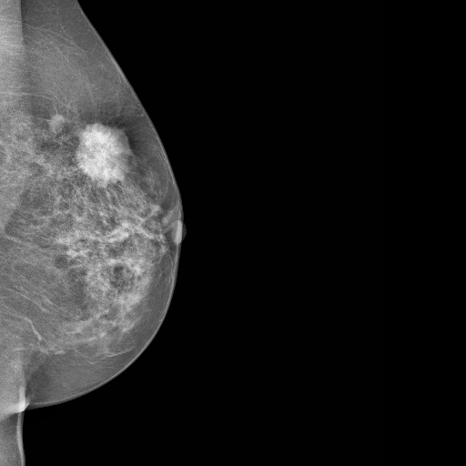</td>
<td></td>
<td></td>
</tr>
<tr>
<td>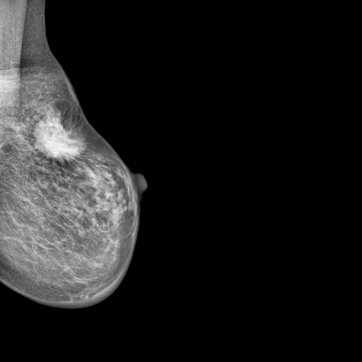</td>
<td></td>
<td></td>
</tr>
<tr>
<td>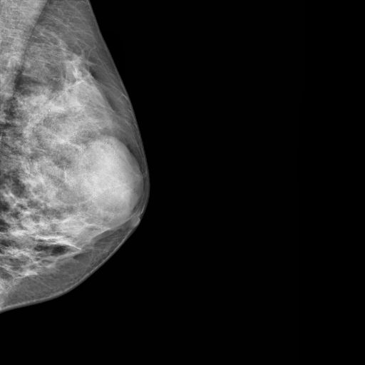</td>
<td></td>
<td></td>
</tr>
</table>

 
<h3>1. Dataset Citation</h3>
The dataset used here has been taken from the web-site: 
which was derived by us from   

<b>INBREAST-SELECTED-IMGS</b> and <b>INBREAST-SELECTED-MSKS</b> <a href="https://github.com/pablogiaccaglia/Breast-Cancer-Segmentation-Datasets/blob/master/README.md#INbreast">
INbreast  
</a> 
  
<a href="https://github.com/pablogiaccaglia/Breast-Cancer-Segmentation-Datasets/blob/master/README.md">
<b>
Breast-Cancer-Segmentation-Datasets
</b>
 
Curated collection of datasets for breast cancer segmentation
</a>
 
 
<b><a href="https://biokeanos.com/source/INBreast">INbreast</b></a> 

The INbreast database is a mammographic database, with images acquired at a Breast Centre, 
located in a Hospital de São João, Breast Centre, Porto, Portugal. INbreast has a total of 115 cases (410 images) 
of which 90 cases are from women with both breasts (4 images per case) and 25 cases are from mastectomy patients 
(2 images per case). Several types of lesions (masses, 
calcifications, asymmetries, and distortions) are included. Accurate contours made by specialists are also provided in XML format. 
 
 
<b>Webpage:</b> 
<a href="https://www.kaggle.com/martholi/inbreast">
https://www.kaggle.com/martholi/inbreast
</a> 
 
 
<b>Licence:</b> 
Name: Resource specific  
<a href="http://medicalresearch.inescporto.pt/breastresearch/index.php/Get_INbreast_Database">
http://medicalresearch.inescporto.pt/breastresearch/index.php/Get_INbreast_Database"
</a> 
 
 
<b>Publications:</b> 
<a href="https://pubmed.ncbi.nlm.nih.gov/22078258/">Nbreast: toward a full-field digital mammographic database PubMed</a>
 
 

<h3>
<a id="2">
2 INbreast ImageMask Dataset
</a>
</h3>
 If you would like to train this INbreast Segmentation model by yourself,
 please download the dataset from the google drive 
<a href="https://drive.google.com/file/d/1Nzw2b4W3Y4cJNww3wV9-EtjAaZv2MCWf/view?usp=sharing">
Augmented-INbreast-ImageMask-Dataset.zip</a>.
 
, expand the downloaded ImageMaskDataset and put it under <b>./dataset</b> folder to be
<pre>
./dataset
└─INbreast
    ├─test
    │   ├─images
    │   └─masks
    ├─train
    │   ├─images
    │   └─masks
    └─valid
        ├─images
        └─masks
</pre>
 
<b>INbreast Statistics</b> 
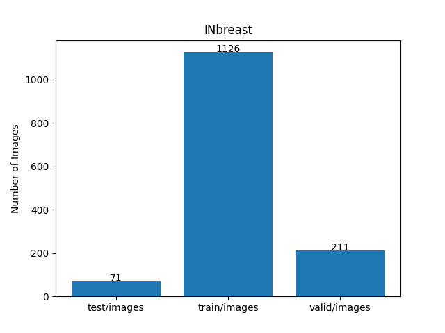 
 

On the derivation of the 512x512 pixels augmented dataset, please refer to the following Python scripts: 
<li><a href="./generator/ImageMaskDatasetGenerator.py">ImageMaskDatasetGenerator.py</a></li>
<li><a href="./generator/split_master.py">split_master.py</a></li>
 

As shown above, the number of images of train and valid datasets is not so large to use for a training set of our segmentation model.
 
 
<b>Train_images_sample</b> 
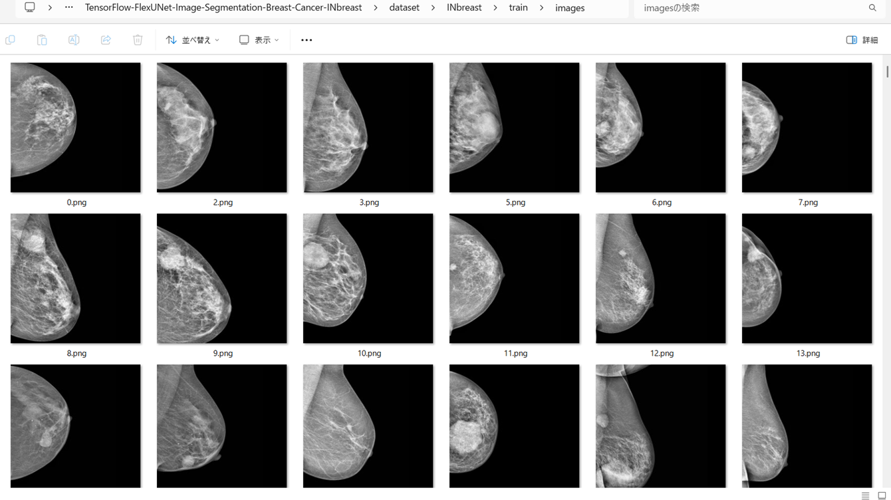
 
<b>Train_masks_sample</b> 
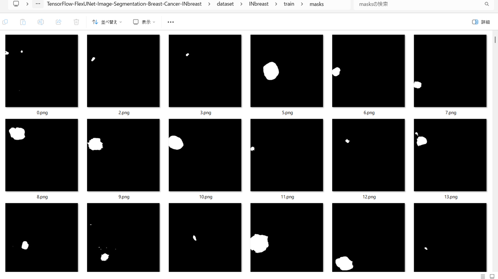
 
<h3>
3 Train TensorFlowFlexUNet Model
</h3>
 We trained INbreast TensorFlowFlexUNet Model by using the following
<a href="./projects/TensorFlowFlexUNet/INbreast/train_eval_infer.config"> <b>train_eval_infer.config</b></a> file.  
Please move to ./projects/TensorFlowFlexUNet/INbreast and run the following bat file. 
<pre>
>1.train.bat
</pre>
, which simply runs the following command. 
<pre>
>python ../../../src/TensorFlowFlexUNetTrainer.py ./train_eval_infer.config
</pre>

<b>Model parameters</b> 
Defined a small <b>base_filters = 16 </b> and large <b>base_kernels = (9,9)</b> for the first Conv Layer of Encoder Block of 
<a href="./src/TensorFlowFlexUNet.py">TensorFlowFlexUNet.py</a> 
and a large num_layers (including a bridge between Encoder and Decoder Blocks).
<pre>
[model]
;You may specify your own UNet class derived from our TensorFlowFlexModel
model         = "TensorFlowFlexUNet"
generator     =  False
image_width    = 512
image_height   = 512
image_channels = 3
num_classes    = 2

base_filters   = 16
base_kernels   = (9,9)
num_layers     = 8
dropout_rate   = 0.04
dilation       = (1,1)
</pre>
<b>Learning rate</b> 
Defined a very small learning rate.  
<pre>
[model]
learning_rate  = 0.00007
</pre>
<b>Loss and metrics functions</b> 
Specified "categorical_crossentropy" and <a href="./src/dice_coef_multiclass.py">"dice_coef_multiclass"</a>. 
<pre>
[model]
loss           = "categorical_crossentropy"
metrics        = ["dice_coef_multiclass"]
</pre>
<b>Dataset class</b> 
Specifed <a href="./src/ImageCategorizedMaskDataset.py">ImageCategorizedMaskDataset</a> class. 
<pre>
[dataset]
class_name    = "ImageCategorizedMaskDataset"
</pre>
 
<b>Learning rate reducer callback</b> 
Enabled learing_rate_reducer callback, and a small reducer_patience.
<pre> 
[train]
learning_rate_reducer = True
reducer_factor     = 0.4
reducer_patience   = 4
</pre>
<b>Early stopping callback</b> 
Enabled early stopping callback with patience parameter.
<pre>
[train]
patience      = 10
</pre>

<b>RGB Color map</b> 
rgb color map dict for INbreast 1+3 classes. 
<pre>
[mask]
mask_file_format = ".png"
; 1+1 classes
; RGB colors   cancer:white     
rgb_map = {(0,0,0):0,(255,255,255):1 }

</pre>

<b>Epoch change inference callback</b> 
Enabled <a href="./src/EpochChangeInfereuncer.py">epoch_change_infer callback</a></b>. 
<pre>
[train]
epoch_change_infer       = True
epoch_change_infer_dir   =  "./epoch_change_infer"
num_infer_images         = 6
</pre>

By using this callback, on every epoch_change, the inference procedure can be called
 for 6 images in <b>mini_test</b> folder. This will help you confirm how the predicted mask changes 
 at each epoch during your training process.    

<b>Epoch_change_inference output at starting (epoch 1,2,3)</b> 
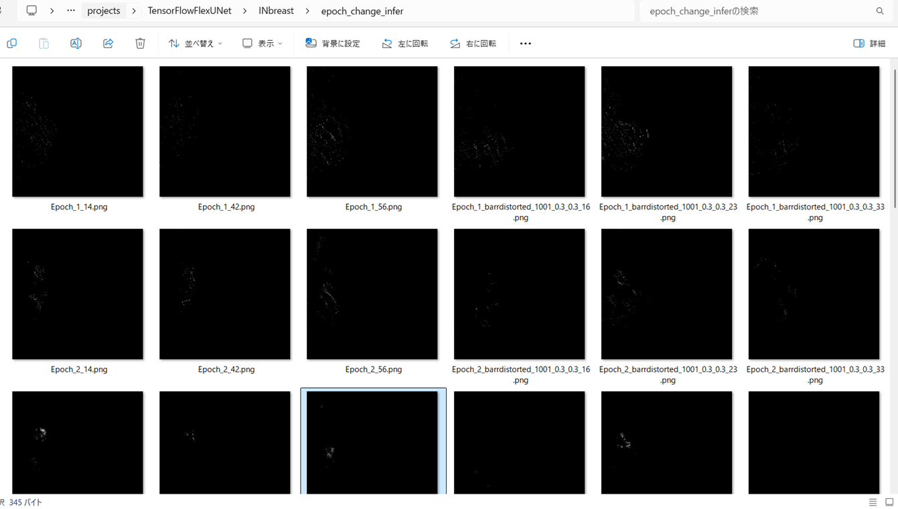 
 
<b>Epoch_change_inference output at middlepoint (epoch 18,19,20)</b> 
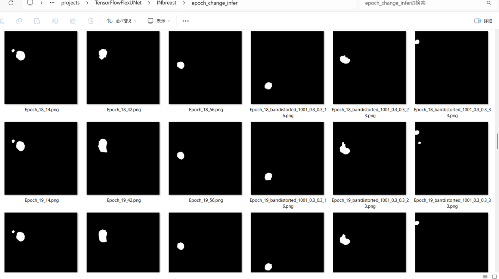 
 
<b>Epoch_change_inference output at ending (epoch 38,39,40)</b> 
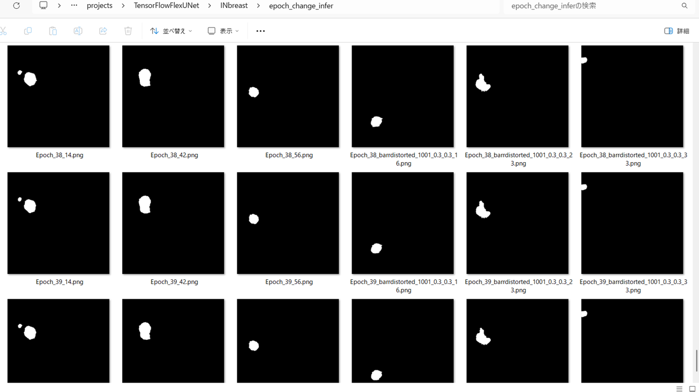 
 
In this experiment, the training process was stopped at epoch 40 by EearlyStopping callback.  
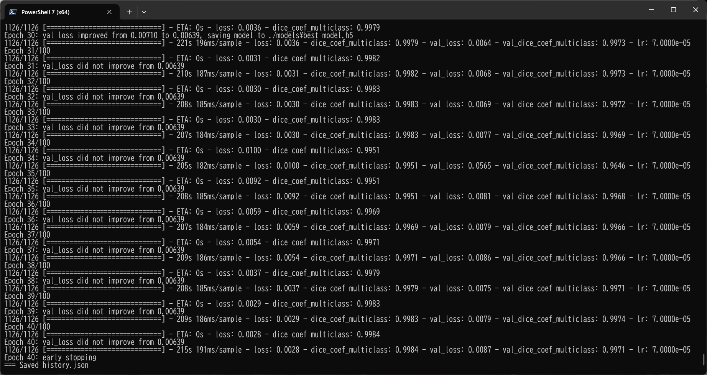 
 

<a href="./projects/TensorFlowFlexUNet/INbreast/eval/train_metrics.csv">train_metrics.csv</a> 
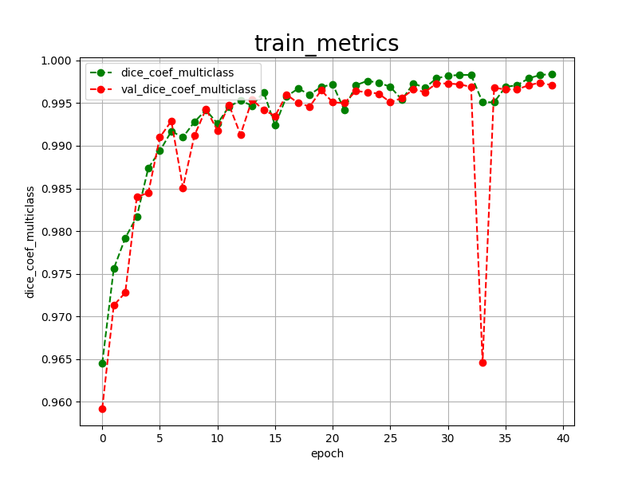 

 
<a href="./projects/TensorFlowFlexUNet/INbreast/eval/train_losses.csv">train_losses.csv</a> 
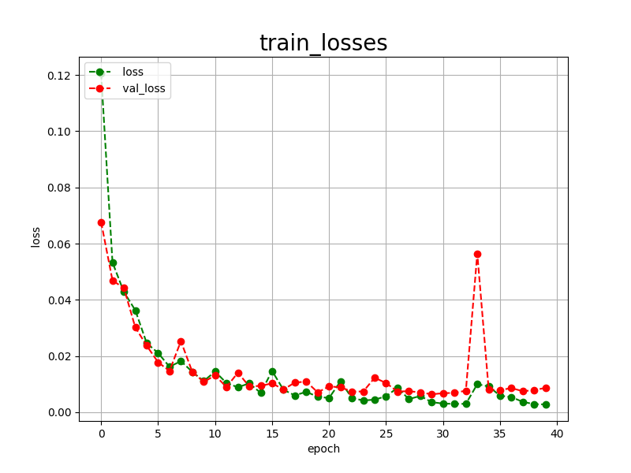 

 

<h3>
4 Evaluation
</h3>
Please move to <b>./projects/TensorFlowFlexUNet/INbreast</b> folder, 
and run the following bat file to evaluate TensorFlowFlexUNet model for INbreast. 
<pre>
./2.evaluate.bat
</pre>
This bat file simply runs the following command.
<pre>
python ../../../src/TensorFlowFlexUNetEvaluator.py ./train_eval_infer_aug.config
</pre>

Evaluation console output: 
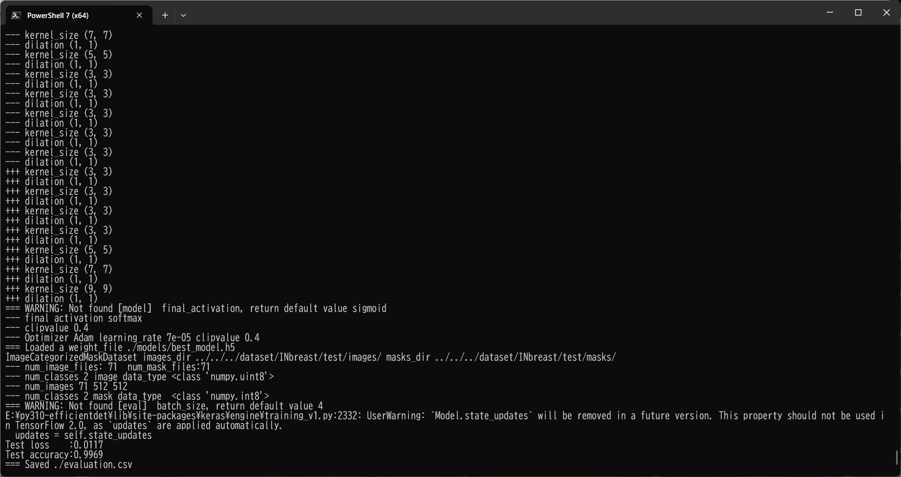
  

<a href="./projects/TensorFlowFlexUNet/INbreast/evaluation.csv">evaluation.csv</a> 
The loss (categorical_crossentropy) to this INbreast/test was low and dice_coef_multiclass 
high as shown below.
 
<pre>
categorical_crossentropy,0.0117
dice_coef_multiclass,0.9969
</pre>
 

<h3>
5 Inference
</h3>
Please move <b>./projects/TensorFlowFlexUNet/INbreast</b> folder 
,and run the following bat file to infer segmentation regions for images by the Trained-TensorFlowFlexUNet model for INbreast. 
<pre>
./3.infer.bat
</pre>
This simply runs the following command.
<pre>
python ../../../src/TensorFlowFlexUNetInferencer.py ./train_eval_infer_aug.config
</pre>

<b>mini_test_images</b> 
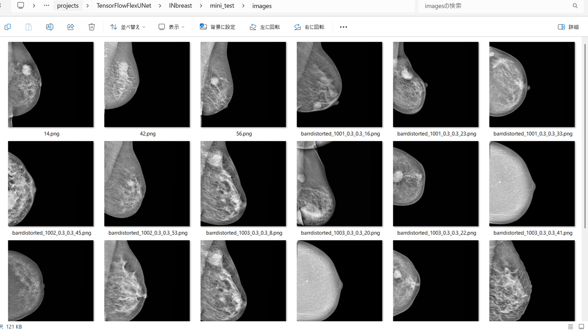 
<b>mini_test_mask(ground_truth)</b> 
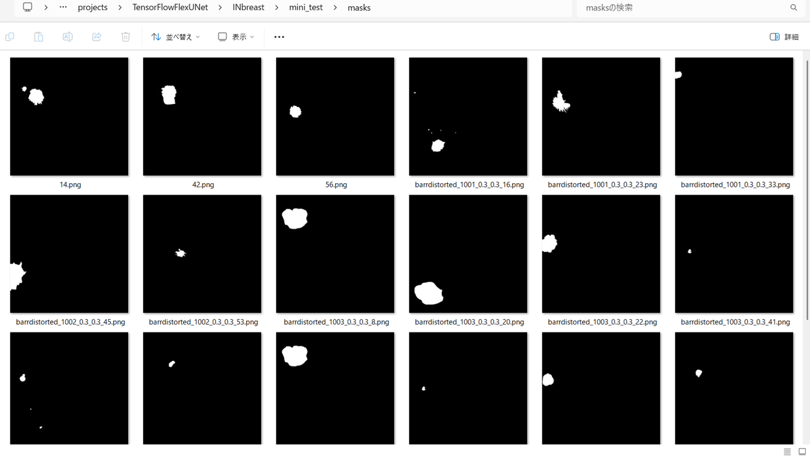 

<b>Inferred test masks</b> 
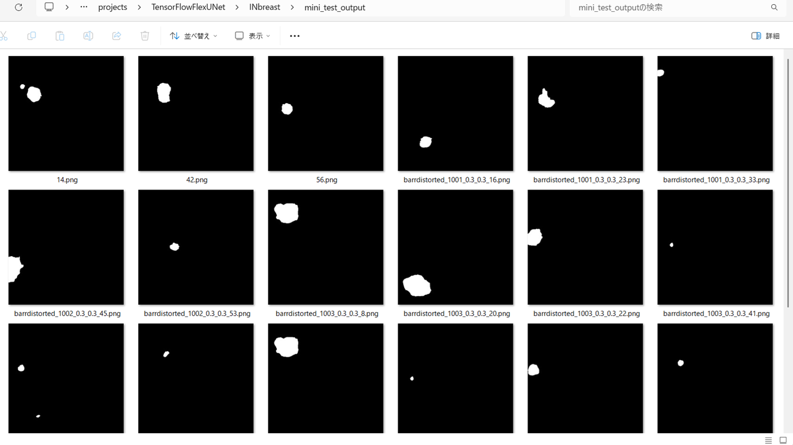 
 

<b>Enlarged images and masks of 512x512 pixels</b> 
<table>
<tr>
<th>Image</th>
<th>Mask (ground_truth)</th>
<th>Inferred-mask</th>
</tr>

<tr>
<td>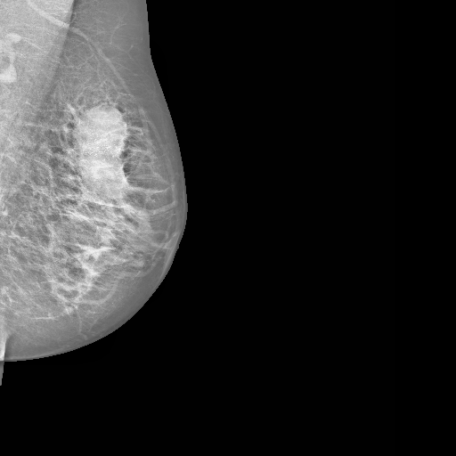</td>
<td></td>
<td></td>
</tr>

<tr>
<td>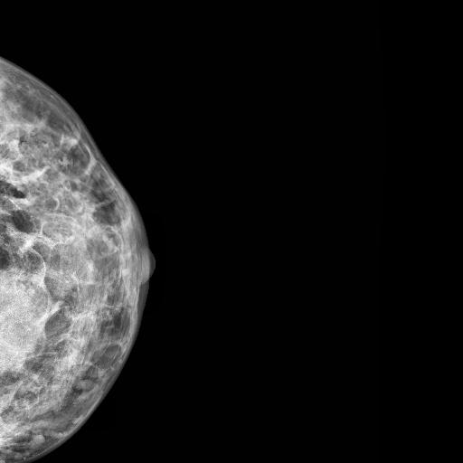</td>
<td></td>
<td></td>
</tr>

<tr>
<td>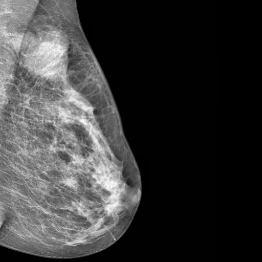</td>
<td></td>
<td></td>
</tr>

<tr>
<td>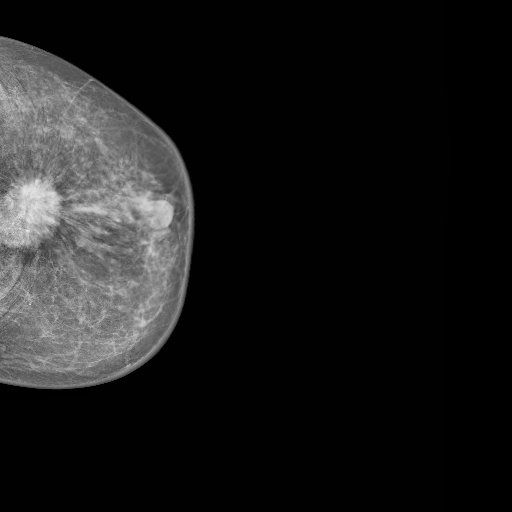</td>
<td></td>
<td></td>
</tr>

<tr>
<td>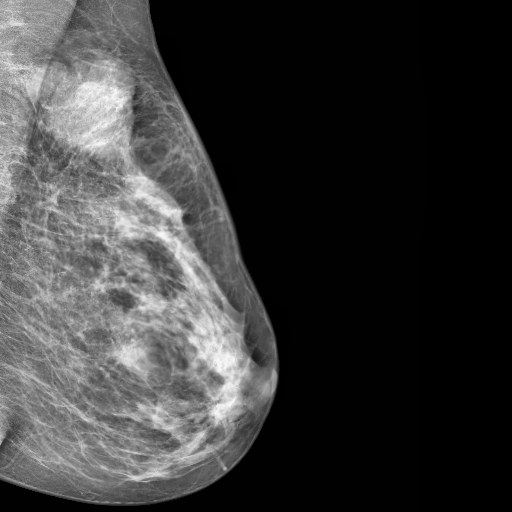</td>
<td></td>
<td></td>
</tr>

<tr>
<td></td>
<td></td>
<td></td>
</tr>
</table>

 
<h3>
References
</h3>
<b>1. INbreast: toward a full-field digital mammographic database </b> 
Inês C Moreira, Igor Amaral, Inês Domingues, António Cardoso, Maria João Cardoso, Jaime S Cardoso 
<a href="https://pubmed.ncbi.nlm.nih.gov/22078258/">https://pubmed.ncbi.nlm.nih.gov/22078258/</a>

 
  
<b>2. Breast-Cancer-Segmentation-Datasets</b>
 
Curated collection of datasets for breast cancer segmentation
</a>
 
pablogiaccaglia 

<a href="https://github.com/pablogiaccaglia/Breast-Cancer-Segmentation-Datasets/blob/master/README.md">
Breast-Cancer-Segmentation-Datasets
</a>
